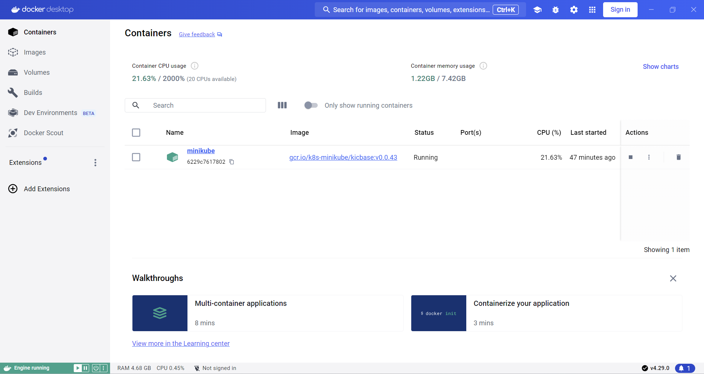
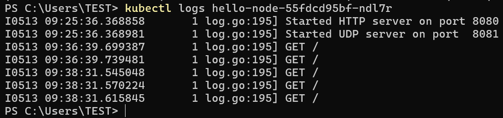
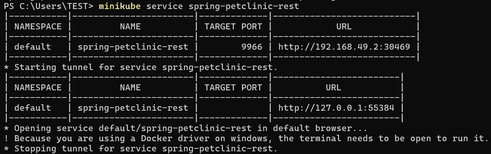
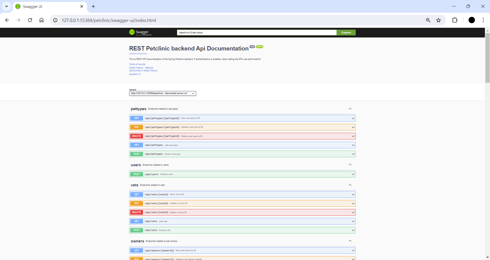
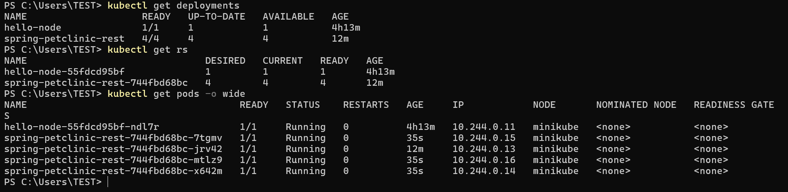
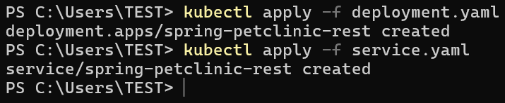

# 📝Tutorial & Exercise 11📝

**Student Details :**

|  Attribute    | Information                |
|---------------|----------------------------|
| Name          | Ardhika Satria Narendra    |
| Student ID    | 2206821866                 |
| Class         | Advanced Programming KKI   |

---

Module 11: Deployment on Kubernetes

## Questions and Answers

### -> Reflection on Hello Minikube

#### 1. What do you see in the logs? Does the number of logs increase each time you open the app?
Before the application is exposed as a service, the logs capture mainly backend operations such as pulling images, starting containers, and registering nodes. These entries reflect the setup and maintenance processes of the Kubernetes environment. Once the application is exposed, each access to the app triggers new log entries, primarily showing HTTP request logs. These entries indicate active interactions with the service, such as GET and POST requests, and detail the servicing of these requests. As a result, the number of logs increases proportionally with each visit to the application, demonstrating direct user interaction. This change highlights the shift from system-focused logs to user interaction logs, giving insight into both the operational status and the active usage of our application.

#### 2. What is the purpose of the `-n` option and why did the output not list the pods/services that you explicitly created?
The `-n` option in `kubectl` commands specifies the namespace from which to list resources, helping to organize and isolate them based on their purpose or ownership. When we use `kubectl get` without the `-n` option, it defaults to the 'default' namespace, which typically contains the resources directly created and managed during typical application deployments. In contrast, specifying `-n kube-system` targets the `kube-system` namespace, which is reserved for system-critical resources necessary for Kubernetes itself to function, such as the DNS service, metrics server, and internal Kubernetes management processes. Since the deployments and services we created during the tutorial were not in the `kube-system` namespace but in the default one, they do not appear in the output when querying `kube-system`. This distinction is crucial for understanding how Kubernetes segregates system components from user-deployed applications, ensuring orderly management and operational clarity across different types of resources.

### -> Reflection on Rolling Update & Kubernetes Manifest File

#### 1. What is the difference between Rolling Update and Recreate deployment strategy?
- **Rolling Update:** This strategy methodically replaces old pods with new ones while maintaining service availability, crucial for production environments where uptime is critical. An instance where I applied this was during a critical update of our customer-facing payment service, which allowed us to introduce necessary enhancements without interrupting user transactions.

- **Recreate Deployment:** This strategy temporarily brings down the entire service, replacing all pods simultaneously, which can lead to noticeable downtime. I used this method during the off-peak hours for our internal reporting tool, which tolerates downtime and allowed for a simpler update process.

#### 2. Try deploying the Spring Petclinic REST using Recreate deployment strategy and document your attempt.

#### 3. Prepare different manifest files for executing Recreate deployment strategy.
- **Manual Deployment:** In earlier projects, manual deployments often led to inconsistencies and errors, such as when deploying a complex microservices architecture manually led to misconfigured services and prolonged downtime.

- **Using Manifest Files:** Transitioning to manifest files, I observed a drastic reduction in deployment errors. A notable instance was the streamlined update of our multi-container application, where manifest files ensured accurate, repeatable deployments, which were crucial during rapid scaling phases.

#### 4. What do you think are the benefits of using Kubernetes manifest files? Recall your experience in deploying the app manually and compare it to your experience when deploying the same app by applying the manifest files (i.e., invoking `kubectl apply -f` command) to the cluster.
- During a major release, using Rolling Updates enabled us to maintain customer service without any noticeable impact. Conversely, when a significant database schema update was required, we opted for the Recreate strategy during scheduled maintenance, accepting downtime in favor of simplicity and full control over the migration process.

- These experiences highlight the strategic choices we make based on the specific needs of each service and the overall business impact.

---

