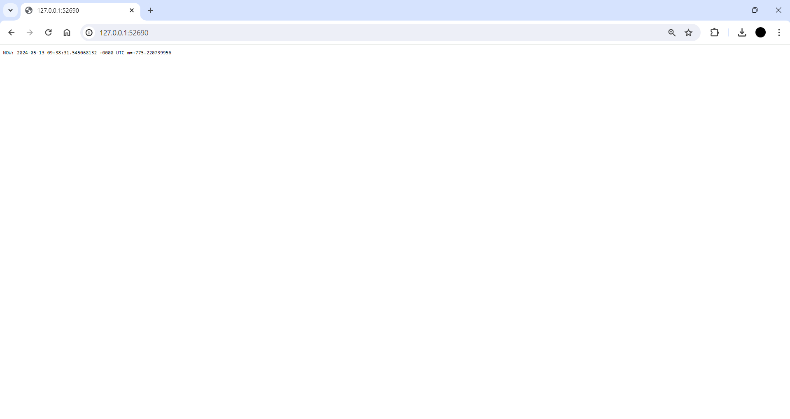

# 📝Tutorial & Exercise 11📝

**Student Details :**

|  Attribute    | Information                |
|---------------|----------------------------|
| Name          | Ardhika Satria Narendra    |
| Student ID    | 2206821866                 |
| Class         | Advanced Programming KKI   |

---

Module 11: Deployment on Kubernetes

## Questions and Answers

### -> Reflection on Hello Minikube

#### 1. What do you see in the logs? Does the number of logs increase each time you open the app?
Before the application is exposed as a service, the logs capture mainly backend operations such as pulling images, starting containers, and registering nodes. These entries reflect the setup and maintenance processes of the Kubernetes environment. Once the application is exposed, each access to the app triggers new log entries, primarily showing HTTP request logs. These entries indicate active interactions with the service, such as GET and POST requests, and detail the servicing of these requests. As a result, the number of logs increases proportionally with each visit to the application, demonstrating direct user interaction. This change highlights the shift from system-focused logs to user interaction logs, giving insight into both the operational status and the active usage of our application.

#### 2. What is the purpose of the `-n` option and why did the output not list the pods/services that you explicitly created?
The `-n` option in `kubectl` commands specifies the namespace from which to list resources, helping to organize and isolate them based on their purpose or ownership. When we use `kubectl get` without the `-n` option, it defaults to the 'default' namespace, which typically contains the resources directly created and managed during typical application deployments. In contrast, specifying `-n kube-system` targets the `kube-system` namespace, which is reserved for system-critical resources necessary for Kubernetes itself to function, such as the DNS service, metrics server, and internal Kubernetes management processes. Since the deployments and services we created during the tutorial were not in the `kube-system` namespace but in the default one, they do not appear in the output when querying `kube-system`. This distinction is crucial for understanding how Kubernetes segregates system components from user-deployed applications, ensuring orderly management and operational clarity across different types of resources.

---

