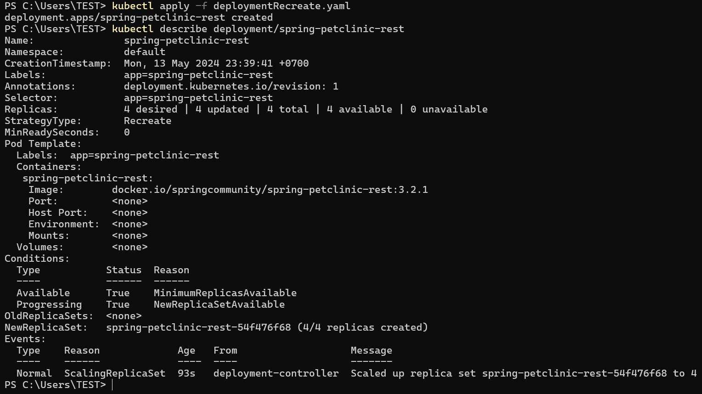

# 📝Tutorial & Exercise 11📝

**Student Details :**

|  Attribute    | Information                |
|---------------|----------------------------|
| Name          | Ardhika Satria Narendra    |
| Student ID    | 2206821866                 |
| Class         | Advanced Programming KKI   |

---
<details>
<summary>Module 11: Deployment on Kubernetes</summary>

## Questions and Answers

### -> Reflection on Hello Minikube


#### 1. What do you see in the logs? Does the number of logs increase each time you open the app?
Before the application is exposed as a service, the logs capture mainly backend operations such as pulling images, starting containers, and registering nodes. These entries reflect the setup and maintenance processes of the Kubernetes environment. Once the application is exposed, each access to the app triggers new log entries, primarily showing HTTP request logs. These entries indicate active interactions with the service, such as GET and POST requests, and detail the servicing of these requests. As a result, the number of logs increases proportionally with each visit to the application, demonstrating direct user interaction. This change highlights the shift from system-focused logs to user interaction logs, giving insight into both the operational status and the active usage of our application.


#### 2. What is the purpose of the `-n` option and why did the output not list the pods/services that you explicitly created?
The `-n` option in `kubectl` commands specifies the namespace from which to list resources, helping to organize and isolate them based on their purpose or ownership. When we use `kubectl get` without the `-n` option, it defaults to the 'default' namespace, which typically contains the resources directly created and managed during typical application deployments. In contrast, specifying `-n kube-system` targets the `kube-system` namespace, which is reserved for system-critical resources necessary for Kubernetes itself to function, such as the DNS service, metrics server, and internal Kubernetes management processes. Since the deployments and services we created during the tutorial were not in the `kube-system` namespace but in the default one, they do not appear in the output when querying `kube-system`. This distinction is crucial for understanding how Kubernetes segregates system components from user-deployed applications, ensuring orderly management and operational clarity across different types of resources.

### -> Reflection on Rolling Update & Kubernetes Manifest File


#### 1. What is the difference between Rolling Update and Recreate deployment strategy?
- **Rolling Update:** This strategy methodically replaces old pods with new ones while maintaining service availability, crucial for production environments where uptime is critical. An instance where I applied this was during a critical update of our customer-facing payment service, which allowed us to introduce necessary enhancements without interrupting user transactions.

- **Recreate Deployment:** This strategy temporarily brings down the entire service, replacing all pods simultaneously, which can lead to noticeable downtime. I used this method during the off-peak hours for our internal reporting tool, which tolerates downtime and allowed for a simpler update process.

#### 2. Try deploying the Spring Petclinic REST using Recreate deployment strategy and document your attempt.
- First, I modify the `deployment.yaml` file to set the deployment strategy to `Recreate`, and then proceed to deploy it.



- Subsequently, I simulate an update by changing the image and then check the update status.


- From the observed outcomes, it is evident that the   `Recreate` deployment strategy terminates all existing pods before spawning new ones, as indicated by the `OldReplicaSets` value being none.


#### 3. Prepare different manifest files for executing Recreate deployment strategy.
Below is the file deployment-recreate.yaml for executing Recreate deployment strategy:

```
apiVersion: apps/v1
kind: Deployment
metadata:
  annotations:
    deployment.kubernetes.io/revision: "1"
    kubectl.kubernetes.io/last-applied-configuration: |
      {"apiVersion":"apps/v1","kind":"Deployment","metadata":{"annotations":{"deployment.kubernetes.io/revision":"4"},"creationTimestamp":"2024-05-13T13:26:28Z","generation":5,"labels":{"app":"spring-petclinic-rest"},"name":"spring-petclinic-rest","namespace":"default","resourceVersion":"6356","uid":"d297e495-ba99-44a8-86d1-1e1c4ec92094"},"spec":{"progressDeadlineSeconds":600,"replicas":4,"revisionHistoryLimit":10,"selector":{"matchLabels":{"app":"spring-petclinic-rest"}},"strategy":{"type":"Recreate"},"template":{"metadata":{"creationTimestamp":null,"labels":{"app":"spring-petclinic-rest"}},"spec":{"containers":[{"image":"docker.io/springcommunity/spring-petclinic-rest:3.2.1","imagePullPolicy":"IfNotPresent","name":"spring-petclinic-rest","resources":{},"terminationMessagePath":"/dev/termination-log","terminationMessagePolicy":"File"}],"dnsPolicy":"ClusterFirst","restartPolicy":"Always","schedulerName":"default-scheduler","securityContext":{},"terminationGracePeriodSeconds":30}}},"status":{"availableReplicas":4,"conditions":[{"lastTransitionTime":"2024-05-13T13:38:23Z","lastUpdateTime":"2024-05-13T13:38:23Z","message":"Deployment has minimum availability.","reason":"MinimumReplicasAvailable","status":"True","type":"Available"},{"lastTransitionTime":"2024-05-13T13:26:28Z","lastUpdateTime":"2024-05-13T13:53:23Z","message":"ReplicaSet \"spring-petclinic-rest-54f476f68\" has successfully progressed.","reason":"NewReplicaSetAvailable","status":"True","type":"Progressing"}],"observedGeneration":5,"readyReplicas":4,"replicas":4,"updatedReplicas":4}}
  creationTimestamp: "2024-05-13T16:39:41Z"
  generation: 1
  labels:
    app: spring-petclinic-rest
  name: spring-petclinic-rest
  namespace: default
  resourceVersion: "5194"
  uid: b1dfeb59-de07-42a9-98ad-35ff96cd7ee3
spec:
  progressDeadlineSeconds: 600
  replicas: 4
  revisionHistoryLimit: 10
  selector:
    matchLabels:
      app: spring-petclinic-rest
  strategy:
    type: Recreate
  template:
    metadata:
      creationTimestamp: null
      labels:
        app: spring-petclinic-rest
    spec:
      containers:
      - image: docker.io/springcommunity/spring-petclinic-rest:3.2.1
        imagePullPolicy: IfNotPresent
        name: spring-petclinic-rest
        resources: {}
        terminationMessagePath: /dev/termination-log
        terminationMessagePolicy: File
      dnsPolicy: ClusterFirst
      restartPolicy: Always
      schedulerName: default-scheduler
      securityContext: {}
      terminationGracePeriodSeconds: 30
status:
  availableReplicas: 4
  conditions:
  - lastTransitionTime: "2024-05-13T16:39:44Z"
    lastUpdateTime: "2024-05-13T16:39:44Z"
    message: Deployment has minimum availability.
    reason: MinimumReplicasAvailable
    status: "True"
    type: Available
  - lastTransitionTime: "2024-05-13T16:39:41Z"
    lastUpdateTime: "2024-05-13T16:39:44Z"
    message: ReplicaSet "spring-petclinic-rest-54f476f68" has successfully progressed.
    reason: NewReplicaSetAvailable
    status: "True"
    type: Progressing
  observedGeneration: 1
  readyReplicas: 4
  replicas: 4
  updatedReplicas: 4


```

#### 4. What do you think are the benefits of using Kubernetes manifest files? Recall your experience in deploying the app manually and compare it to your experience when deploying the same app by applying the manifest files (i.e., invoking `kubectl apply -f` command) to the cluster.

Kubernetes manifest files provide a standardized way of defining applications and services within the cluster. By using these files, we can ensure consistent configurations across different environments and deployments. This is beneficial compared to manual deployments which might vary slightly each time and are more prone to human error.

---

</details>